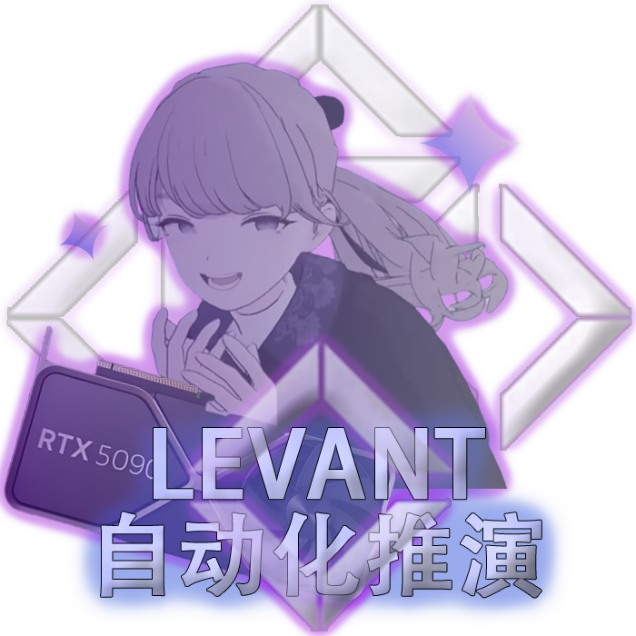

# LEVANT 自动化推演引擎 (Levant Engine) v1.01



> **Powered by 絜矩 | 您的 AI 叙事沙盒与战略推演伙伴**

[](https://github.com/ASTion24/Levant/releases/latest)
[](https://github.com/ASTion24/Levant/issues)
[](./LICENSE)

---

## 📖 简介 | Introduction

**您是否曾梦想过一个能与您共同呼吸、共同创造世界的推演工具？**

Levant 专为充满想象力的创作者——无论是文字游戏、跑团（TRPG）、安科（Anco）还是复杂的战略推演的主持人（GM）——量身打造。它不仅仅是一个记录工具，更是一个智能的创意伙伴，旨在将现代大语言模型（LLM）的无限创造力，与严谨的状态机逻辑无缝结合。

Levant 将帮助您高效地管理宏大的世界观、追踪每个实体的动态变化、构建清晰的时间线，并从繁琐的重复性工作中解放出来，让您能更专注于故事的核心——**创造与抉择**。

## 🌟 核心功能亮点 | Feature Showcase

### 🤖 智能推演核心 (AI Deduction Core)

将 AI 从一个简单的文本生成器，转变为真正理解您世界的“副驾”。

*   **上下文感知推演**：仅需一句简单的指令（例如：“A国对B国边境进行军事试探”），Levant 即可结合当前世界的所有状态（势力强弱、历史恩怨、全局变量），智能地生成合乎逻辑的事件摘要、详细的战报/新闻稿，并自动计算出对各势力的属性影响。
*   **AI 剧本生成器**：灵感枯竭？只需提供一个世界观主题（例如：“赛博朋克、魔法、废土”），AI 即可为您初始化一套完整的剧本，包括势力、规则、背景资料和开场事件，让您在几分钟内开启一场全新的冒险。
*   **上下文装配器**：在执行推演前，您可以像搭积木一样，精确选择本次需要提供给 AI 的“记忆切片”——哪些资料、哪些历史、哪些势力状态。实现对 AI 思维的精准引导，杜绝“胡言乱语”。

### 🗄️ 可视化数据库 (Visual Database)

让复杂的世界设定变得直观、可控，一切尽在掌握。

*   **实体（Faction）管理**：轻松创建和编辑拥有自定义属性、代表色和 FontAwesome 图标的势力或角色。所有状态变化一目了然。
*   **动态资料库（Lorebook）**：这不只是一个设定集！您可以将每条资料设置为`常驻 (On)`、`自动触发 (Auto)`或`禁用 (Off)`。当推演指令中包含关键词时，“自动触发”的资料会被动态加载，让您的设定真正“活”起来，参与到故事的演进中。
*   **全局变量（Global Vars）**：轻松管理影响整个世界的宏观状态，如“当前年份”、“战争阶段”、“魔法潮汐强度”等。

### 🎨 一键生成精美战报 (One-Click Poster Generation)

将推演中的关键时刻，转化为值得分享的艺术品。

*   **赛博朋克终端风格**：生成充满科技感的情报简报，适合未来、科幻题材的推演分享。
*   **复古新闻报纸风格**：将重大事件渲染成一张充满历史厚重感的旧报纸头条，适合历史、奇幻题材。
*   **多用途卡片**：不仅是事件，势力档案、世界规则、资料设定等都可以一键导出为设计精美的图片，方便您在社交媒体上分享您的世界。

### 工作流与本地化 (Workflow & Localization)

*   **高效工作流**：通过“待决序列”，您可以一次性生成多个事件草稿，统一校对、修改后，一次性“提交（Commit）”形成一个完整的回合，极大提升推演效率。
*   **完全本地化**：所有数据（包括您的剧本、存档）均以开放的 `.json` 格式保存在您自己的电脑上。您的心血之作完全由您掌控，安全、私密、永不丢失。
*   **双重主题**：内置精心设计的“终端 (Dark)”和“报纸 (Light)”两种 UI 风格，适应不同创作心境。

## 🚀 快速开始 | Quick Start

本程序已打包，**普通用户无需安装 Python 或任何编程环境**。

### 前提条件

*   一个可用的 AI API Key（支持 Google Gemini 或 OpenAI 兼容的 API 服务）。

### 安装与运行

1.  前往 **[Releases 页面](https://github.com/ASTion24/Levant/releases/latest)** 下载最新版本的 `.zip` 压缩包。
2.  解压到您电脑的任意位置（**建议路径中不要包含中文或特殊字符**）。
3.  双击运行文件夹内的 **`Levant启动器.exe`**。
4.  程序会自动启动后台服务，并呼出您的默认浏览器加载操作界面。
5.  首次使用，请点击右上角的**设置图标 (⚙️)**，填入您的 API Key。

> **💡 提示**：如果遇到“网络错误”或 AI 无响应，请在设置中开启“本地代理”并检查端口是否正确（默认为 `7890`）。

## 👨‍💻 开发者指南 (从源码运行)

如果您希望修改代码或进行二次开发，请遵循以下步骤：

1. **克隆仓库**

   ```bash
   git clone https://github.com/ASTion24/Levant.git
   cd Levant
   ```

2. **创建并激活虚拟环境**

   ```bash
   # 创建
   python -m venv venv
   # 激活 (Windows)
   .\venv\Scripts\activate
   ```

3. **安装依赖**

   ```bash
   pip install -r requirements.txt
   ```

4. **运行程序**

   ```bash
   python server.py
   ```

## 📬 联系与反馈 | Contact

如果您在使用过程中遇到 Bug，或有任何绝妙的功能建议，欢迎通过以下方式联系开发者：

*   **提 Issue**：在 **[GitHub Issues](https://github.com/ASTion24/Levant/issues)** 页面提交您的问题。
*   **直接联系**：QQ `2124223354` (絜矩)

## ✨ 特别鸣谢 | Acknowledgments

Levant 的诞生离不开社区伙伴们的灵感碰撞、测试反馈与精神支持。在此向以下朋友致以最诚挚的谢意：

**(按首字母/拼音顺序排列)**

*   **B** - 白湛婷
*   **C** - 长宁
*   **C** - 吹雪
*   **C** - 蠢萌
*   **J** - 江子诺
*   **J** - 杰瑞
*   **K** - 氪学
*   **L** - 冷风
*   **Q** - QQ
*   **Q** - 秋静叶
*   **T** - 唐飞
*   **W** - 王冠
*   **W** - 维新
*   **X** - 虚实
*   **Y** - 夜影
*   **Z** - 朱朱

---

### 🕯️ 献给 | Dedication

**尤其鸣谢：拜占庭、东方**

*“薪火相传，愿光指引方向。”*
*衷心地盼望你归来。*

---

**Levant Engine**
*Developed by 絜矩*
*Copyright © 2025. All Rights Reserved.*